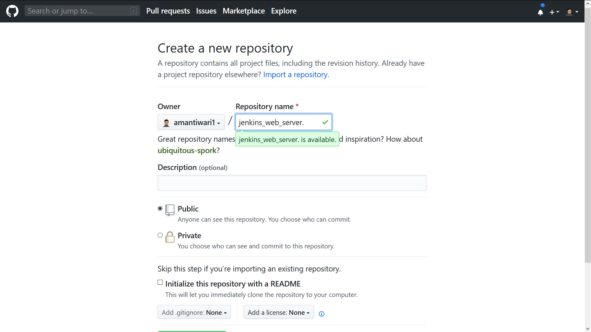

# Git, Jenkins, Docker Tutorial
## how to install Git, Jenkins and Docker in Redhat 8

---

## Git Setup


## you have to download git software below and Install it 


### Windows
[Install Git in Windows](https://git-scm.com/download/win) 

### MacOS
[Install Git in MacOS](https://git-scm.com/download/mac)

### Redhat 8 


```
yum install git
```

If not Working 


```
wget https://github.com/git/git/archive/v2.10.1.tar.gz -O git.tar.gz
tar -zxf git.tar.gz
cd git-2.10.1/
make configure
./configure --prefix=/usr/local
make install
```


---


## Jenkins Setup in RedHat 8 

### Note :  only Works in Redhat 


### Download repo file and Import to  /etc/yum.repos.d

```
sudo wget -O /etc/yum.repos.d/jenkins.repo https://pkg.jenkins.io/redhat-stable/jenkins.repo
sudo rpm --import https://pkg.jenkins.io/redhat-stable/jenkins.io.key
```

Install jenkins


```
yum install jenkins
```


---


## Docker Setup in Redhat 8

### Step by Step 

Go to yum.repos.d


```
cd /etc/yum.repos.d
```

make new file 'dokcer.repo'


```
vim docker.repo 
```

### or 

```
 gedit docker.repo 
```

type it in docker.repo

```
[docker]
baseurl = https://download.docker.com/linux/centos/7/x86_64/stable/
gpgcheck=0
```

install docker 

``` 
yum install docker 
```
thats it!!! 
---
## Get Start Together!!

### Create New Github Account

[Git Account Sign up](https://github.com/join) 

###  Create New repository in github

[Create repository](https://github.com/new)



#### Step 1 : Type Name repository.

#### Step 2 : Create repository 


 
 


